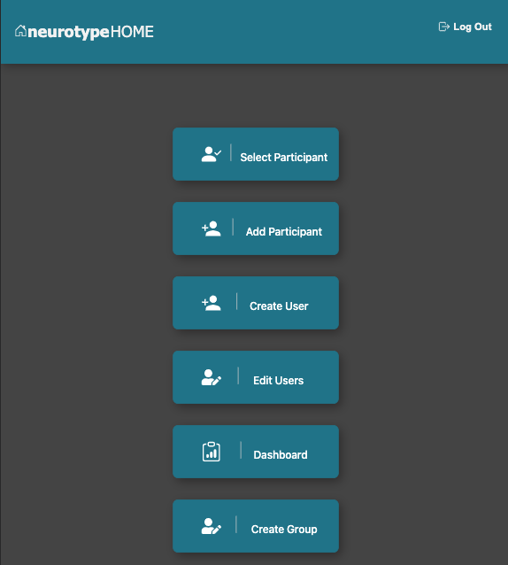
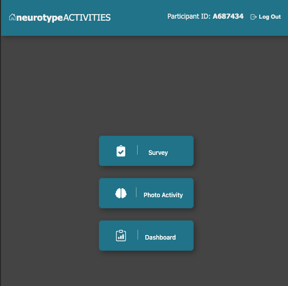
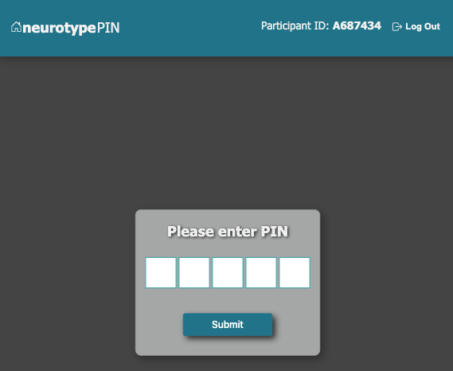
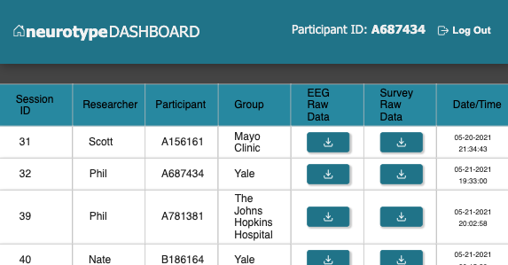
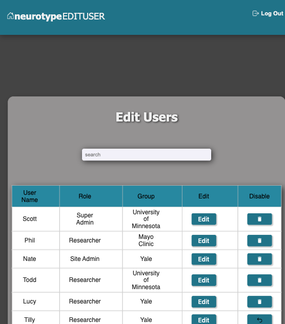

# Neurosity

This tablet web application is designed to allow a researcher to obtain data from study participants and store the raw data in a database and on AWS. The application allows for three different researcher roles: Super Admin, Site Admin and Researcher. Each researcher role has different access to data. The Super Admin can view data from all research groups and the Site Admin and Researchers can only view data from their own research group (site). Any researcher can initiate a session. Within each session the participant can take a survey and/or provide EEG data. Once the data collection is complete for the survey or EEG, the data is automatically uploaded to AWS and stored locally on the database. The participant is unable to see any data that is generated. Following data generation, the researcher can evaluate the data that was generated by visiting the dashboard. 

This application was presented on Facebook live and Zoom on 6/1/2021.

Heroku Link: https://neurotype.herokuapp.com/

Admin Login - this screenshot displays all of the options available to an admin. Each role is conditionally rendered to provide access to allowed functions:

Activities - this screenshot shows navigation page to the Neurosity Survey and EEG repos:

Pin - this screenshot shows an enhanced security feature to stop study participants and other unauthorized users from viewing private participant data: 

Dashboard - this screenshot shows the data available in the different sessions and provides a download link to the file stored in the cloud (AWS): 

Edit User - this screenshot shows the Super Admin and Site Admin ability to change information or disable a user: 

## Technologies

- Javascript
- HTML
- CSS
- Material UI
- React
- Redux
- Saga
- Express
- Node
- Postgres
- AWS
- ChartsJS

